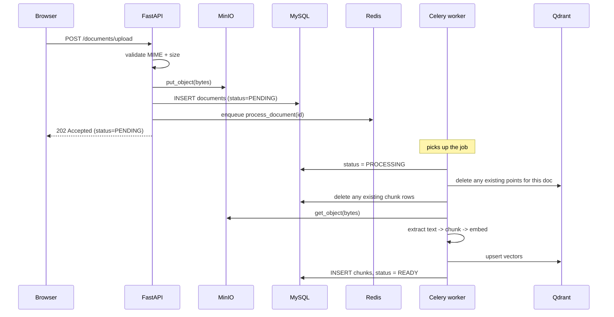

# Document Processing Flow

How a file goes from "user clicked upload" to "searchable, citable content" in RECALL.

This traces the **ingestion** half of the system. The retrieval half (what happens when you
ask a question) is a separate path documented in `BACKEND_DECISIONS.md` Phases 4-5.

---

## Table of contents

- [The shape of it](#the-shape-of-it)
- [Which store holds what](#which-store-holds-what)
- [Stage 1 — Upload (synchronous)](#stage-1--upload-synchronous)
- [Stage 2 — The handoff](#stage-2--the-handoff)
- [Stage 3 — The Celery task (asynchronous)](#stage-3--the-celery-task-asynchronous)
- [The status state machine](#the-status-state-machine)
- [Failure handling](#failure-handling)
- [Why reprocessing works for free](#why-reprocessing-works-for-free)
- [Deletion — the flow in reverse](#deletion--the-flow-in-reverse)
- [Known consistency gaps](#known-consistency-gaps)
- [Tuning constants](#tuning-constants)
- [Code map](#code-map)

---

## The shape of it

The single most important design fact: **uploading and processing are two different
transactions, in two different processes, connected by a queue.**

The HTTP request does as little as possible — validate, store the bytes, write one row,
drop a message on a queue, return `202 Accepted`. Everything expensive happens later in a
Celery worker.



Why this split: embedding a 100-page PDF takes seconds to minutes. Doing that inline would
blow past any sane HTTP timeout and pin a web worker for the duration. Splitting it means
upload stays fast, and you scale processing by adding workers rather than web servers.

The user-visible consequence is that a freshly uploaded document is **not immediately
searchable**. It shows as `PENDING`, then `PROCESSING`, then `READY`. The Vault UI polls
status to reflect this.

---

## Which store holds what

| Store | Holds | Why there |
|---|---|---|
| **MinIO** | the original PDF/DOCX bytes | object storage is cheap and built for blobs; S3-compatible so it can swap to S3 later |
| **MySQL** | `documents` metadata + `document_chunks` raw text | relational queries, ownership filtering, and the `FULLTEXT` index for keyword search |
| **Qdrant** | one 384-dim vector per chunk | purpose-built ANN search with metadata filtering |
| **Redis** | the job queue | Celery broker |

Note that **chunk text lives in MySQL, and the chunk's vector lives in Qdrant**, linked by
`qdrant_point_id`. The text is duplicated into Qdrant's payload as well, so retrieval can
build citations without a MySQL round-trip.

---

## Stage 1 — Upload (synchronous)

Entry point: `POST /api/v1/documents/upload` — [documents.py](../backend/app/api/v1/documents.py)

**1. Authenticate.** `Depends(get_current_user)` resolves the bearer token to a `User`.

**2. Resolve the workspace.**
```python
workspace = (
    WorkspaceService.get_by_id(db, workspace_id, user.id)   # explicit -> ownership checked
    if workspace_id is not None
    else WorkspaceService.get_or_create_default(db, user.id)  # implicit -> lazily created
)
```
If you pass a `workspace_id` that isn't yours, `get_by_id` raises **404** (not 403 — see the
ownership convention in `BACKEND_DECISIONS.md` 1.2). If you pass nothing, a `Default`
workspace is created on demand, so every document always has a home.

**3. Validate and store the bytes** — `DocumentService.upload_to_minio`:

```python
if file.content_type not in ALLOWED_MIME_TYPES:     # PDF + DOCX only
    raise HTTPException(415, ...)

minio_key = f"{user_id}/{uuid.uuid4().hex}{ext}"    # never the user's filename

data = await file.read()                            # whole file into memory
size = len(data)
if size > MAX_FILE_SIZE:                            # 50MB
    raise HTTPException(413, ...)

client.put_object(settings.MINIO_BUCKET, minio_key, BytesIO(data), length=size, ...)
```

Three things worth noticing here:

- **The MIME check is an allowlist, not a blocklist.** Only the two formats the pipeline can
  actually parse are accepted at all. A blocklist would let through anything nobody thought
  to ban.
- **The storage key is `{user_id}/{uuid4}{ext}`**, deliberately *not* the original filename.
  This avoids collisions between two users' identically-named files, and avoids ever putting
  user-supplied text into a storage path.
- **The size check happens after `read()` but before `put_object()`.** So an oversized file is
  fully read into memory before being rejected — it never reaches MinIO, but it does briefly
  cost RAM. That's the tradeoff for a simple in-memory upload path.

**4. Write the metadata row** — `DocumentService.create_record`. Note what is *not* set here:
`status`. It defaults to `PENDING` via the column's `server_default`.

**5. Record the activity event** — `MemoryService.record(..., DOCUMENT_UPLOADED, ...)`. This is
best-effort; it can never raise, so a logging failure can't fail the upload.

**6. Enqueue and return.** `DocumentService.enqueue_processing(doc.id)` → `202 Accepted`.

---

## Stage 2 — The handoff

```python
def enqueue_processing(document_id: int) -> None:
    process_document.delay(document_id)
```

**Only the document ID crosses the queue** — not the file, not the metadata. The worker
re-reads everything from the source of truth. That keeps the message tiny and means a job
sitting in the queue can't go stale.

The Celery config ([celery_app.py](../backend/app/core/celery_app.py)) sets two settings that
matter for reliability:

```python
task_acks_late=True,            # ack only after the task finishes
worker_prefetch_multiplier=1,   # take one job at a time
task_reject_on_worker_lost=True,
```

- `acks_late` means if a worker dies mid-task, Redis redelivers the job rather than losing it.
  The alternative (ack on receipt) is faster but silently drops work on a crash.
- `prefetch_multiplier=1` stops one worker hoarding a batch of jobs that an idle worker could
  have taken. Document jobs are long and infrequent, so fair distribution beats throughput.

> **Windows note:** the worker must run with `--pool=solo`. Celery's default prefork pool
> doesn't work on Windows. This is an operational necessity, not a concurrency decision.

---

## Stage 3 — The Celery task (asynchronous)

[document_processor.py](../backend/app/tasks/document_processor.py)

The worker has **its own database session** (`SessionLocal()`), not a request-scoped one —
there is no HTTP request here.

### 3.1 Load and claim

```python
doc = db.query(Document).filter(Document.id == document_id).first()
if doc is None:
    return                      # deleted before the worker got to it — nothing to do

owner_id = doc.user_id          # captured now: commits expire ORM attributes, and the
filename = doc.original_filename  # failure paths below still need them after a rollback

doc.status = DocumentStatus.PROCESSING
doc.error_message = None        # cleared on every attempt, so stale errors never linger
db.commit()
```

Note the query filters by `id` only, with no `user_id` — unlike every HTTP path. That's
correct here: this is trusted internal code acting on an ID the system itself enqueued, not
user input.

### 3.2 Wipe anything already there

```python
def _wipe_existing(db, qdrant, document_id):
    db.query(DocumentChunk).filter(DocumentChunk.document_id == document_id).delete()
    db.commit()
    qdrant.delete(collection_name=COLLECTION_NAME, points_selector=Filter(
        must=[FieldCondition(key="document_id", match=MatchValue(value=document_id))]))
```

This runs **unconditionally**, on first processing and re-processing alike. On a first run it
deletes nothing. This single decision is what makes the whole task idempotent — see
[below](#why-reprocessing-works-for-free).

### 3.3 Fetch the bytes back

```python
response = minio.get_object(settings.MINIO_BUCKET, doc.minio_key)
try:
    raw = response.read()
finally:
    response.close()
    response.release_conn()      # MinIO's client requires both, or the pool leaks
```

### 3.4 Extract text

The two formats are handled differently, and the difference matters downstream:

```python
if doc.mime_type == "application/pdf":
    pages = _extract_pdf_pages(raw)          # [(1, "..."), (2, "..."), ...]
elif doc.mime_type == "...wordprocessingml.document":
    text = _extract_docx_text(raw)
    pages = [(None, text)] if text.strip() else []   # single blob, no page number
else:
    raise PermanentProcessingError(...)
```

- **PDF** (via PyMuPDF/`fitz`) is extracted **page by page**, with pages numbered from 1, and
  empty pages skipped. This is what makes page-level citations possible later.
- **DOCX** (via `python-docx`) has no native page concept — pagination is a rendering artifact,
  not part of the file format. So it's extracted as one blob with `page_number = None`, and
  DOCX citations show no page number.

### 3.5 Chunk

```python
splitter = RecursiveCharacterTextSplitter(
    chunk_size=CHUNK_SIZE_TOKENS,        # 512
    chunk_overlap=CHUNK_OVERLAP_TOKENS,  # 50
    length_function=_token_len,          # tiktoken cl100k_base
)
```

Two deliberate choices:

- **Sizing is by token, not character.** Tokens are what the embedding model and the LLM
  context window actually consume, so character counts would be a proxy that drifts.
- **Splitting happens per page** (for PDFs), inside the page loop. That's what keeps
  `page_number` attached to each chunk. `chunk_index` is a **global running counter across
  pages**, not per-page — so it uniquely identifies a chunk within the document.

The 50-token overlap means a sentence straddling a boundary appears in full in at least one
chunk, rather than being cut in half in both.

If no chunks survive, that's a permanent failure:
```python
if not chunk_rows:
    raise PermanentProcessingError("No extractable text found in document")
```
This is the scanned-PDF case — a PDF of page *images* with no text layer. OCR is explicitly
out of scope (PRD Non-Goals), so such a file can never succeed.

### 3.6 Embed

```python
model = get_embedding_model()                    # BAAI/bge-small-en-v1.5, local, CPU
vectors = model.encode(texts, batch_size=32, normalize_embeddings=True)
```

Local and free — no per-token API cost regardless of volume. `normalize_embeddings=True`
makes cosine similarity equivalent to a dot product, matching the collection's
`Distance.COSINE`. Output is 384-dim, which must match `VECTOR_SIZE` in
[qdrant_client.py](../backend/app/core/qdrant_client.py).

### 3.7 Build both representations

For each chunk, two objects are built from the same source:

```python
point_id = _point_id(document_id, row["chunk_index"])
# = uuid5(NAMESPACE, f"{document_id}:{chunk_index}")  -- deterministic, not uuid4
```

| | MySQL `DocumentChunk` | Qdrant `PointStruct` |
|---|---|---|
| id | autoincrement | `point_id` (deterministic UUID5) |
| text | `content` | `payload["text"]` (duplicated) |
| position | `chunk_index`, `page_number` | same, in payload |
| vector | — | the 384-dim embedding |
| link | `qdrant_point_id` | `payload["document_id"]` |

The **deterministic point ID** is the second half of the idempotency story: reprocessing
document 42 always regenerates the exact same IDs, so an `upsert` replaces vectors in place
instead of leaving orphans beside the new ones.

### 3.8 Commit

```python
qdrant.upsert(collection_name=COLLECTION_NAME, points=points)   # vectors first

db.add_all(chunk_objs)
doc.status = DocumentStatus.READY
doc.chunk_count = len(chunk_objs)
db.commit()                                                      # then MySQL

MemoryService.record(db, owner_id, ActivityEventType.DOCUMENT_READY, ...)
```

Only now does the document become visible to search — retrieval filters on
`status == READY`.

---

## The status state machine

```
                 ┌──────────────────────────────┐
                 ▼                              │
   (insert) → PENDING → PROCESSING → READY ─────┤ reprocess
                             │                  │
                             └───→ FAILED ──────┘
```

| Status | Meaning | `error_message` |
|---|---|---|
| `PENDING` | row exists, job queued, worker hasn't started | `NULL` |
| `PROCESSING` | a worker is actively working on it | `NULL` (cleared on each attempt) |
| `READY` | chunks + vectors exist, searchable | `NULL` |
| `FAILED` | terminal for this attempt; reprocessable | the reason, truncated to 1000 chars |

It's a real DB enum rather than a boolean `is_ready`, because the UI genuinely renders four
different things — a queued badge, a spinner, a normal row, and an error with a reason.

`POST /documents/{id}/reprocess` rejects with **409** if status is already `PENDING` or
`PROCESSING`, then resets to `PENDING` and re-enqueues the same task.

> That check-then-set has a theoretical TOCTOU race under concurrent double-clicks — no row
> lock is held across the check and the enqueue. The consequence of losing that race is a
> duplicate processing run, which is harmless precisely because the task is idempotent.
> A `SELECT ... FOR UPDATE` held across a network hop to Redis was judged the worse trade.

---

## Failure handling

The task distinguishes two error classes, and treats them oppositely:

```python
except PermanentProcessingError as exc:      # corrupt file, no text, unsupported type
    db.rollback()
    doc.status = FAILED
    doc.error_message = str(exc)[:1000]
    db.commit()
    MemoryService.record(..., DOCUMENT_FAILED, ...)
    # NOT re-raised -> Celery considers the task successful -> no retry

except Exception as exc:                     # anything else
    db.rollback()
    if self.request.retries >= self.max_retries:
        doc.status = FAILED
        doc.error_message = str(exc)[:1000]
        db.commit()
        MemoryService.record(..., DOCUMENT_FAILED, ...)
    raise                                    # re-raised -> Celery retries with backoff
```

**Permanent** failures are never retried. A corrupt PDF will not parse on the third attempt
any more than the first — retrying just delays the user finding out, while burning backoff
delays.

**Transient** failures are retried up to 3 times with exponential backoff capped at 60s, for
this specific set:

```python
autoretry_for=(ConnectionError, TimeoutError, DBAPIError, UnexpectedResponse, MinioException)
```

That's "the infrastructure hiccuped" — Qdrant blipped, MySQL dropped the connection, MinIO
timed out. Those genuinely do succeed on a retry. Only when retries are exhausted does the
document land in `FAILED`.

`finally: db.close()` always runs, so the session is never leaked on any path.

---

## Why reprocessing works for free

`POST /documents/{id}/reprocess` needed **no new logic in the task at all**. It works because
two decisions made during the original build happen to compose:

1. **`_wipe_existing` runs unconditionally**, so the task never assumes it's starting from
   a clean slate.
2. **Point IDs are `uuid5(ns, f"{document_id}:{chunk_index}")`**, so regenerating produces
   identical IDs and `upsert` overwrites rather than accumulating.

Together these make the task safe to run an unbounded number of times on the same document.
The reprocess endpoint is therefore just: check status, reset to `PENDING`, re-enqueue the
same task.

This is also what makes it safe to re-run everything after changing the chunking strategy or
the embedding model.

---

## Deletion — the flow in reverse

`DocumentService.delete` unwinds all three stores, children before parents:

```python
doc = DocumentService.get_by_id(db, document_id, user_id)   # 404 if not yours
get_qdrant_client().delete(...)          # 1. vectors
db.query(DocumentChunk).delete(); db.commit()   # 2. chunk rows
get_minio_client().remove_object(...)    # 3. the file
db.delete(doc); db.commit()              # 4. the metadata row
```

Deleting the `documents` row last means that if any earlier step fails, the document still
exists and the delete can be retried. The reverse order would orphan data with no record
pointing at it.

---

## Known consistency gaps

Three systems, no distributed transaction. These are accepted, not overlooked:

| Gap | When | Consequence | Mitigation |
|---|---|---|---|
| MinIO write succeeds, DB insert fails | crash between steps 3 and 4 of upload | orphaned object in MinIO, no `documents` row | none currently — the blob is unreferenced and invisible |
| Qdrant upsert succeeds, MySQL commit fails | crash in 3.8 | vectors exist with no chunk rows | self-heals: `_wipe_existing` clears them on the retry |
| Delete partially fails | any step of delete | some stores still hold data | `documents` row survives, so delete can be retried |

None cause user-visible incorrectness, because retrieval only reads documents whose status
is `READY` **and** resolves results through MySQL — a stray Qdrant point with no matching
row simply won't surface.

---

## Tuning constants

| Constant | Value | Where |
|---|---|---|
| `ALLOWED_MIME_TYPES` | PDF, DOCX | `documentService.py` |
| `MAX_FILE_SIZE` | 50 MB | `documentService.py` |
| `CHUNK_SIZE_TOKENS` | 512 | `document_processor.py` |
| `CHUNK_OVERLAP_TOKENS` | 50 | `document_processor.py` |
| `EMBEDDING_BATCH_SIZE` | 32 | `document_processor.py` |
| `VECTOR_SIZE` | 384 | `qdrant_client.py` |
| `COLLECTION_NAME` | `recall_documents` | `qdrant_client.py` |
| max retries / backoff cap | 3 / 60 s | `document_processor.py` |

> Changing `CHUNK_SIZE_TOKENS`, `CHUNK_OVERLAP_TOKENS`, or the embedding model invalidates
> every existing chunk and vector. All documents must be reprocessed. Changing `VECTOR_SIZE`
> additionally requires **deleting and recreating the Qdrant collection** — `get_qdrant_client()`
> only creates the collection when it's missing, so it will otherwise keep the old dimension
> and every upsert will fail on a size mismatch.

---

## Code map

| Step | File | Symbol |
|---|---|---|
| HTTP endpoint | `app/api/v1/documents.py` | `upload_document` |
| Validation + MinIO write | `app/services/documentService.py` | `upload_to_minio` |
| Metadata row | `app/services/documentService.py` | `create_record` |
| Enqueue | `app/services/documentService.py` | `enqueue_processing` |
| Queue config | `app/core/celery_app.py` | `celery_app` |
| The task | `app/tasks/document_processor.py` | `process_document` |
| Idempotency wipe | `app/tasks/document_processor.py` | `_wipe_existing` |
| PDF extraction | `app/tasks/document_processor.py` | `_extract_pdf_pages` |
| DOCX extraction | `app/tasks/document_processor.py` | `_extract_docx_text` |
| Deterministic IDs | `app/tasks/document_processor.py` | `_point_id` |
| Embeddings | `app/core/embeddings.py` | `get_embedding_model` |
| Vector store | `app/core/qdrant_client.py` | `get_qdrant_client` |
| Object store | `app/core/minio_client.py` | `get_minio_client` |
| Models | `app/models/document.py`, `app/models/document_chunk.py` | `Document`, `DocumentChunk` |
| Reprocess / delete | `app/services/documentService.py` | `reprocess`, `delete` |
